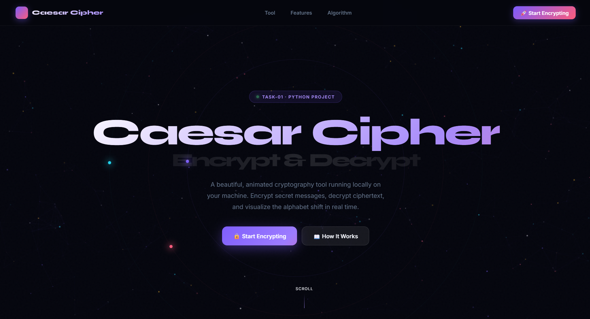

<div align="center">


<br/>

[](https://python.org)
[](https://flask.palletsprojects.com)
[](https://developer.mozilla.org/en-US/docs/Web/HTML)
[](https://developer.mozilla.org/en-US/docs/Web/CSS)
[](https://developer.mozilla.org/en-US/docs/Web/JavaScript)
[](LICENSE)

<br/>

> ### 🔐 *A beautiful, animated web-based Caesar Cipher tool — encrypt and decrypt secret messages with a 3D particle background, running entirely on your local machine.*

<br/>

</div>

---

## 📸 Preview

<!-- Replace this with your actual screenshot -->
<div align="center">

</div>

> 📌 *To add your screenshot: take a screenshot of `localhost:5000`, save it as `screenshot.png` in the project root.*

---

## ✨ Features

<table>
  <tr>
    <td align="center" width="200">🔒<br/><b>Encrypt</b><br/><sub>One-click message encryption with custom shift</sub></td>
    <td align="center" width="200">🔓<br/><b>Decrypt</b><br/><sub>Instantly decode any Caesar-ciphered text</sub></td>
    <td align="center" width="200">🔍<br/><b>Brute Force</b><br/><sub>Try all 25 shifts at once to crack unknown ciphers</sub></td>
  </tr>
  <tr>
    <td align="center">🎚️<br/><b>Shift Slider</b><br/><sub>Interactive 1–25 shift selector with live preview</sub></td>
    <td align="center">🔤<br/><b>Alphabet Map</b><br/><sub>Full A→Z visual mapping with highlighted active letters</sub></td>
    <td align="center">✨<br/><b>3D Particle BG</b><br/><sub>Live starfield that reacts to mouse movement</sub></td>
  </tr>
  <tr>
    <td align="center">📊<br/><b>Live Stats</b><br/><sub>Character count, letters shifted, shift used</sub></td>
    <td align="center">📋<br/><b>Copy Output</b><br/><sub>One-click copy with green flash confirmation</sub></td>
    <td align="center">⌨️<br/><b>Keyboard</b><br/><sub>Ctrl+Enter shortcut to process message</sub></td>
  </tr>
</table>

---

## 🚀 Quick Start

### Prerequisites

Make sure you have **Python 3** installed on your system.

```bash
python --version   # Should be 3.x
```

### Installation & Run

```bash
# 1. Clone or download the project
git clone https://github.com/enthem-nitishh/caesar-cipher-tool.git
cd caesar-cipher-tool

# 2. Install the only dependency
pip install flask

# 3. Start the server
python app.py

# 4. Open in your browser
# → http://localhost:5000
```

> ✅ That's it! No complex setup, no build tools, no database.

---

## 📁 Project Structure

```
caesar_cipher/
│
├── 📄 app.py                ← Flask backend · cipher logic · API routes
├── 📄 requirements.txt      ← Python dependencies (just Flask)
├── 📄 README.md             ← This file
│
└── 📁 templates/
    └── 📄 index.html        ← Full animated frontend (HTML + CSS + JS)
```

---

## 🔬 How Caesar Cipher Works

The Caesar Cipher is one of the oldest and simplest encryption techniques. Each letter in the plaintext is shifted by a fixed number of positions in the alphabet.

```
Plaintext:   H  E  L  L  O     W  O  R  L  D
Shift:       +3 +3 +3 +3 +3    +3 +3 +3 +3 +3
Ciphertext:  K  H  O  O  R     Z  R  U  O  G
```

**Formula:**

```
Encrypt:  C = (P + shift) mod 26
Decrypt:  P = (C - shift) mod 26
```

- Letters are shifted, spaces and symbols stay unchanged
- Wraps around the alphabet (Z + 3 = C)
- Case is preserved (uppercase stays uppercase)

---

## 🔌 API Endpoints

| Method | Endpoint | Description |
|--------|----------|-------------|
| `GET`  | `/` | Serves the main UI |
| `POST` | `/process` | Encrypt or decrypt a message |
| `POST` | `/brute` | Try all 25 shifts on a message |

### `/process` — Request Body

```json
{
  "text": "Hello World",
  "shift": 3,
  "mode": "encrypt"
}
```

### `/process` — Response

```json
{
  "output": "Khoor Zruog",
  "original": "Hello World",
  "shift": 3,
  "mode": "encrypt",
  "alphabet": ["A", "B", "C", "..."],
  "shifted":  ["D", "E", "F", "..."],
  "char_count": 11,
  "letter_count": 10,
  "word_count": 2
}
```

---

## 🛠️ Tech Stack

| Technology | Role |
|------------|------|
| **Python 3** | Core language |
| **Flask** | Web server & API |
| **HTML5 + CSS3** | Animated frontend UI |
| **Vanilla JavaScript** | Interactivity, fetch API |
| **Canvas API** | 3D particle background |
| **Google Fonts** | Syne + JetBrains Mono typography |

---

## 📊 Project Stats

```
Lines of Python  →  ~60
Lines of HTML    →  ~800+
Shift Values     →  25
Cipher Modes     →  2 (Encrypt / Decrypt)
Bonus Features   →  Brute Force cracker
```

---

## 🎯 Task Checklist

- [x] Python program to encrypt text using Caesar Cipher
- [x] Python program to decrypt text using Caesar Cipher
- [x] User can input a message
- [x] User can choose a custom shift value (1–25)
- [x] Web-based UI running on localhost
- [x] Attractive animated interface with 3D background
- [x] **Bonus:** Brute Force cracker (try all 25 shifts)
- [x] **Bonus:** Alphabet mapping visualization
- [x] **Bonus:** Live statistics (char count, word count, etc.)

---

## 👨‍💻 Author

<div align="center">

**Made with ❤️ for Task-01**

[](https://github.com/enthem-nitishh)

</div>

---

<div align="center">


</div>
